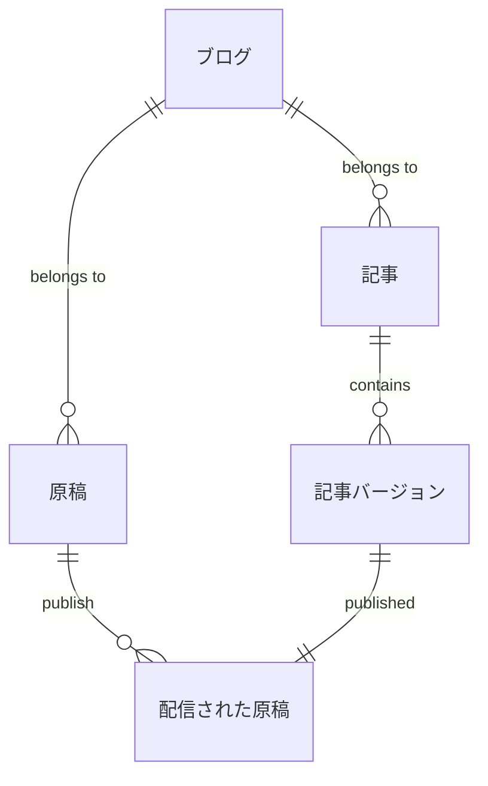
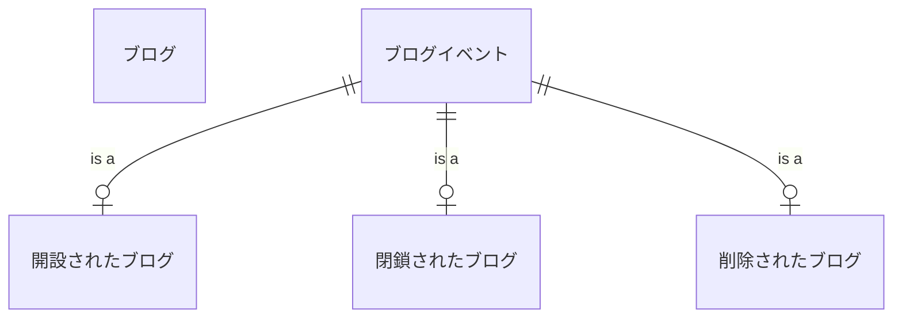
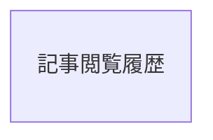
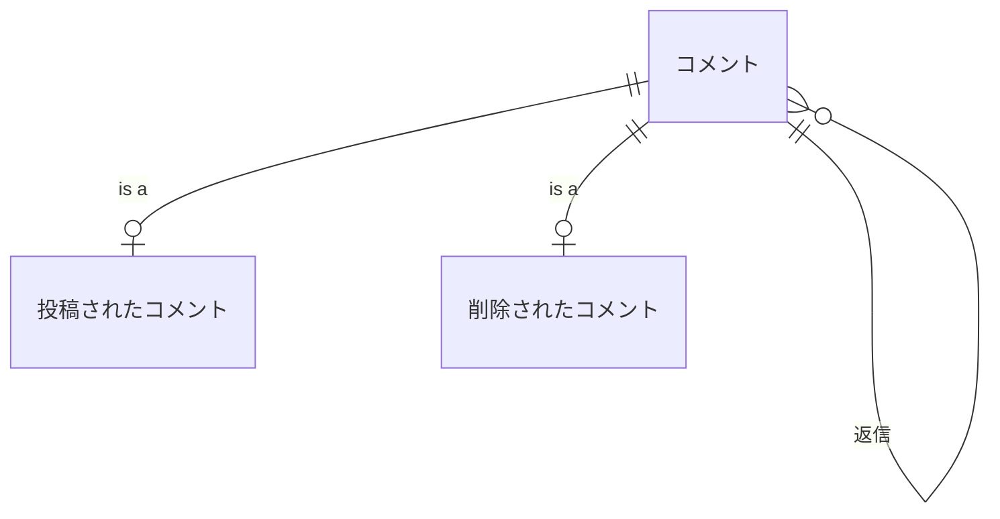

# ユースケース記述

## 記事原稿管理コンテキスト

### 関係モデル

```
ブログ(ブログ識別子)
原稿(原稿識別子, ブログ識別子, タイトル, 本文, 公開状態)
配信された原稿(原稿識別子, 配信日時, タイトル, 本文)
記事(原稿識別子, ブログ識別子, 初回投稿日時, 公開状態)
記事バージョン(原稿識別子, バージョン番号, タイトル, 本文, 更新日時)
```

### ER図



### 記事を配信する

執筆者は原稿を書くボタンをクリックする。
システムは原稿編集画面を開く。
執筆者はタイトルと本文を入力し、公開するボタンをクリックする。
システムは原稿の内容を保存し、記事を配信する。

### 原稿を保存する

執筆者は原稿を書くボタンをクリックする。
システムは原稿編集画面を開く。
執筆者はタイトルと本文を入力し、保存するボタンをクリックする。
システムは原稿の内容を保存する。

### 記事を更新する

執筆者は原稿をクリックする。
システムは原稿編集画面にタイトルと本文を表示する。
執筆者はタイトルと本文を入力し、公開するボタンをクリックする。
システムは原稿の内容を保存し、配信中の記事の新しい版を配信する。

### 記事の配信を取りやめる

執筆者は原稿をクリックする。
システムは原稿編集画面にタイトルと本文を表示する。
執筆者はタイトルと本文を入力し、下書きに戻すボタンをクリックする。
システムは原稿の内容を保存し、配信中の記事を非公開にする。

### 原稿をゴミ箱に入れる

執筆者はゴミ箱に入れるボタンをクリックする。
システムは原稿をゴミ箱に入れ、配信中の記事を非公開にする。

## ブログ管理コンテキスト

### 関係モデル

```
ブログ(ブログID, 名前, 所有者アカウントID, 開設日時)
ブログイベント(ブログID, 発生日時)
  開設されたブログ(ブログ識別子, 名前, 所有者アカウントID)
  閉鎖されたブログ(ブログ識別子)
  削除されたブログ(ブログ識別子)
```

### ER図



### ユーザーがブログを開設する。

ユーザーはブログ開設画面を開く。
ユーザーはブログのタイトルとブログのサブドメインを入力する。
ユーザーは開設ボタンをクリックする。
システムはブログをデータベースに登録し、新しいサブドメインでブログへのリクエストを許可する。

### ブログ所有者がブログを閉鎖する。

ブログ所有者が閉鎖ボタンをクリックする。
システムは確認ダイアログを表示する。
ブログ所有者はダイアログにブログのサブドメインを入力し、閉鎖のボタンをクリックする。
入力されたサブドメインが正しいサブドメインだったら、システムはブログを閉鎖する。

## 記事閲覧コンテキスト

### 関係モデル

```
記事閲覧履歴(ブログ識別子, 記事識別子, ユーザー識別子, 閲覧日時)
```

### ER図



### ユースケース

#### ユーザーが記事を閲覧する

ユーザーが記事を開く。
システムは記事閲覧履歴を追加する。

## コメントコンテキスト

### 関係モデル

```
コメント(コメント識別子, 記事識別子, 親コメント識別子)
  書き込まれたコメント(コメント識別子, ユーザー識別子, 内容)
  削除されたコメント(コメント識別子)
```

### ER図



### ユースケース

#### ユーザーが記事にコメントを書き込む

ユーザーが記事を開く。
ユーザーが記事にコメントを書き込む。
システムはユーザーが書いたコメントを記録する。

#### ユーザーがコメントを削除する

ユーザーが記事を開く。
ユーザーが自分が書いたコメントの削除ボタンをクリックする。
システムはコメントを削除する。
